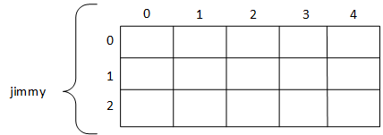

# C++ Introduction

## C++ reserved keywords

asm, auto, bool, break, case, catch, char, class, const, const_cast, continue, default, delete, 
do, double, dynamic_cast, else, enum, explicit, export, extern, false, float, for, friend, goto, 
if, inline, int, long, mutable, namespace, new, operator, private, protected, public, register, 
reinterpret_cast, return, short, signed, sizeof, static, static_cast, struct, switch, template, 
this, throw, true, try, typedef, typeid, typename, union, unsigned, using, virtual, void, 
volatile, wchar_t, while 

## Identifiers

variable name, method or function name, program file name

```cpp
int main () 
{   
    int a = 5; 
    int b = 2;
    cout << a + b;
    return 0; 
}
```

## Fundamental Data Type
Name | Description | Size* | Range*
|--- |---          |---    |---    | 
|char |Character or small integer. |1byte |signed: -128 to 127 unsigned: 0 to 255 |
|short int (short) |Short Integer. |2bytes |signed: -32768 to 32767 unsigned: 0 to 65535| 
|int |Integer. |4bytes |signed: -2147483648 to 2147483647 unsigned: 0 to 4294967295| 
|long int (long) |Long integer. |4bytes |signed: -2147483648 to  2147483647 unsigned: 0 to 4294967295| 
|bool  |Boolean value. It can take one of two values: true or false.  |1byte   |true or false | 
|float |Floating point number. |4bytes |+/- 3.4e +/- 38 (~7 digits)|
|double |Double precision floating point number. |8bytes |+/- 1.7e +/- 308 (~15 digits)|
|long double |Long double precision floating point number. |8bytes |+/- 1.7e +/- 308 (~15 digits)| 
|wchar_t |Wide character. |2 or 4 bytes |1 wide character| 

## Declaration of variables

```c++
int a; 
float mynumber;
int x, y, z;
unsigned short int NumberOfSisters;
signed int MyAccountBalance; 
short Year; 
short int Year;
unsigned NextYear; 
unsigned int NextYear;
```

### Character and string literals
```c++
char c = 'z';
char p = 'p';
string hw = "Hello world";
string hdyd = "How do you do?";
```

```
Escape squence:

\n newline 
\r carriage return 
\t tab 
\v vertical tab 
\b backspace 
\f form feed (page feed)
\a alert (beep) 
\' single quote (') 
\" double quote (") 
\? question mark (?) 
\\ backslash (\)
```

### Defined constants (#define) 

```cpp
#define PI 3.14159
#define NEWLINE '\n'
```

[Built in math functions](https://www.cplusplus.com/reference/cmath/)

### Declared constants (const) 

Declear a constant by **const** key word.

```cpp
const int pathwidth = 100; 
const char tabulator = '\t';
```

## Operators
Source file: ~operator/operator.cpp
### Assignment Operator (=)

```cpp
float radius = 3.0;
int a = 5;
int b = a;
int c, d, e, f, g;
a = b = c = 5;
```

### Arithmetic operators ( +, -, *, /, % ) 

```
+ addition 
- subtraction 
* multiplication
/ division 
% modulo 
```

### Compound assignment (+=, -=, *=, /=, %=, >>=, <<=, &=, 
^=, |=)

expression         |is equivalent to
|---               |---            | 
value += increase; |value = value + increase;
a -= 5;            |a = a - 5;
a /= b;            |a = a / b;
price *= units + 1;|price = price * (units + 1);

### Increase and decrease operators(++, --)

```cpp
int a = 3;
a++;
cout << a << endl
```

### Relational and equality operators ( ==, !=, >, <, >=, <= )

Operator | Description
|---     |---          |
|== | Equal to| 
|!= | Not equal to| 
|>  |Greater than| 
|<  |Less than 
|>= |Greater than or equal to
|<= |Less than or equal to 

### Logical operators ( !, &&, || ) 

&& Operator (and (与操作）operator)

a |b |a && b
|--- | --- |---|
true |true |true 
true |false|false 
false|true |false 
false|false|false

|| Operator （or （或操作）operator

a    |b    |a \|\| b
|--- |---  |---|
true |true | true 
true |false|true 
false|true |true 
false|false|false 

### Bitwise Operators ( &, |, ^, ~, <<, >> )

## Array
Source file: ~dataType/array.cpp

### 1 demensional array

### Multidimensional 
~dataType/array.cpp

```cpp
int jimmy[3][5];
```


